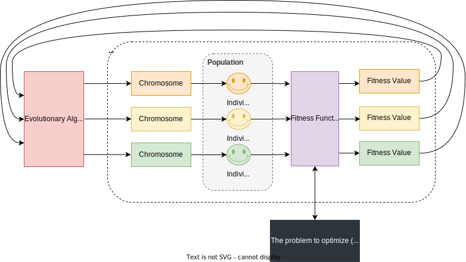

# 🧬 ChromoSolve: Unraveling Evolutionary Algorithms
Accelerate optimization and problem-solving in .NET with versatile evolutionary algorithms.

> **A .NET evolutionary algorithms library**

ChromoSolve provides an easy-to-use and versatile platform, simplifying the implementation and experimentation of evolutionary algorithms like Differential Evolution (DE), Genetic Evolution (GE), and beyond.

### What Are Evolutionary Algorithms?

Evolutionary algorithms are inspired by the process of natural evolution—think about how creatures adapt and evolve over generations to better survive in their environment. These algorithms utilize similar principles, such as selection, mutation, and crossover (mixing traits), to find solutions to problems.

#### Key Terms

- **Population**: Imagine a group of solutions to a problem, much like a flock of birds, each trying to reach a destination in their own way.
  
- **Individual**: Each bird in our metaphorical flock represents an individual solution to the problem.

- **Genotype**: The genetic code of each individual. Think of it as a unique recipe of ingredients (variables) that defines it.

- **Phenotype**: The actual expression or outcome resulting from that genetic code or recipe (like a baked cookie).

#### Basic Workflow of Evolutionary Algorithm:

1. **Initialization**: We start by creating our first population, which is like gathering our first flock of birds, each having a unique way (genotype) to reach the destination.
   
2. **Mapping (Genotype to Phenotype)**: Think of the genotype as a map each bird is using to reach the destination. When a bird follows its map (genotype), the actual path it takes and its final landing spot is the phenotype.
   
3. **Fitness Evaluation**: After the birds land, we determine how close each one got to the desired destination. This measurement of success is called "fitness."
   
4. **Selection**: Birds that land closer to the destination (those with higher fitness) are chosen to create the next generation because they have proved that their maps have some valuable information.
   
5. **Crossover (Mating)**: Now, we create new maps (genotypes) for the next flock by combining parts of the maps from the selected birds, hoping to integrate the best parts from each parent map into the offspring.
   
6. **Mutation**: Occasionally, we slightly alter a bit of the new maps randomly. This represents a tiny change in the path to explore new possibilities we might not have seen otherwise.
   
7. **New Population (Offspring)**: The new flock, created from crossovers and mutations, forms the next generation that will follow their maps (genotypes) and create new paths (phenotypes).

8. **Repeat**: Steps 3-7 are repeated: evaluating the new paths, selecting the best birds, creating new maps, and forming new generations, until a bird finds the ideal or near-perfect landing spot, or until we decide to stop the process.

9. **Termination**: When we find a solution that’s good enough or when we have iterated through the process a predetermined number of times, we conclude the algorithm.



#### In a Nutshell:
- Evolutionary algorithms mimic the principle of the survival of the fittest.
- We iteratively create generations of solutions, evaluating and selectively breeding them to produce better and better outcomes over time.
- The entire process is a cycle of mapping genotypes to phenotypes, assessing fitness, and generating new solutions until our goal is satisfactorily met!

This is a simple analogy to help understand the concept. In practice, EAs solve far more complex, multi-dimensional problems where the solution is not as straightforward as finding a single destination point.

### What Are They Good For?

1. **Solving Complex Problems**: Some problems have so many variables and possible solutions that trying all of them isn’t feasible. Evolutionary algorithms can find good (even if not absolutely perfect) solutions to these complex problems faster than other approaches.

2. **Optimization**: They are great for finding the best solution out of many possible solutions—like minimizing costs for a business or maximizing the performance of a machine.

3. **Adapting to Changes**: They can also adjust and find new solutions if the problem changes over time, making them versatile and flexible.

4. **Innovation**: Sometimes, they can come up with creative, innovative solutions that might not be immediately obvious to a human problem solver.

In a nutshell, evolutionary algorithms are like super-smart trial and error machines. They try out lots of different solutions, learn from the best ones, and iteratively improve upon them to solve problems or optimize outcomes!

### Is an Evolutionary Algorithm Right for Your Problem?

1. **Black Box Scenario**: You have a problem where you can input variables and observe results, but don’t necessarily know how the inputs are transformed into outputs.
   
2. **Evaluating Goodness**: While the optimal input is unknown, you can judge the quality of a solution when you see one by observing and measuring the output it produces.

**If both apply, evolutionary algorithms might be a solid approach for your problem optimization!**


## 🚀 Quick Start

### Installation

```sh
dotnet add package ChromoSolve
```

### Basic Usage

See the *Samples* folder:

| Sample                         | Description                   |
|--------------------------------|-------------------------------|
| **Traveling Salesman Problem** | Help Bob, the salesman find an optimal route to visit multiple cities.<br/>**Start here** if you're new to evolutionary algorithms. |
| **Knapsack Problem**           | Find an optimal way how to split certain amount of cash amongst multiple enveloper.<br/>A slightly **more advanced** demo than the above. |

## 🧬 Features

| Evolutionary Algorithm          | Status              |
|---------------------------------|---------------------|
| **Differential Evolution (DE)** | ✅ Supported           |
| **Genetic Evolution (GE)**      | 🕑 Not available yet   |


## 📘 Documentation

TODO

## 🤝 Contributing

Want to contribute? Great! I don't have any contribution guide yet. Just let me know and we can figure something out.

## 📜 License

ChromoSolve is [MIT licensed](LICENSE).